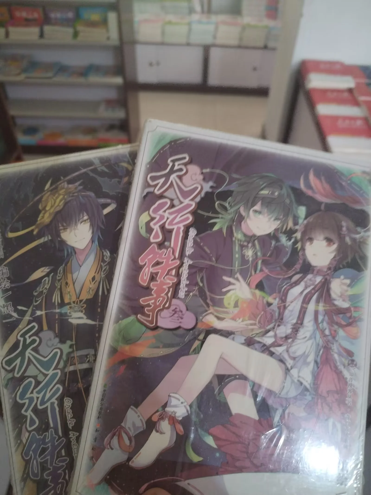

偶然翻到自己2024年暑假买的两本《天行轶事》3、4册，不知不觉已经快过去两年了。其实当时我也没想到县城的书店还能留着这种古董一样的漫画书，毕竟书店最大的客户是学校，很多书店本质上是一个大型教辅仓库，尤其是这类冠名【文教】的书店。两本20元，原价拿下，我当时还觉得这样多年卖不出去的漫画应当有打折才对，后来在贴吧和各大二手平台调研一番，才发现这玩意早就不是原价能买到的了。

连载这部漫画作品的《知音漫客》也早已经在2023年坠机了。起初公告说是休刊到当年10月，但之后便再没了下文；后来也有些许风声，似乎终于要打赢复活赛了，但终究还是没能肘赢牢大。~~故人好似风中落叶，陆续飘零~~

在小学三四年级，我就已经见到过《知音漫客》了，不过因为当时没开智，加上没看过连载漫画之前的剧情，暂时没有什么能力欣赏。当时最爱看的是漫画Party，或者叫怕踢，阿衰和星太奇承包了我整个小学的笑点。教室里时常会出没一本破破烂烂的盗版阿衰漫画书，通常用劣质纸张打印厚厚一本，而且有很严重的色偏。2026年了，猫小乐老师当年在漫画中预言的未来并没有到来，他没有去给别人设计签名，阿衰成了一代人心中的经典之作，但怕踢上的熟面孔越来越少了，阿衰也渐渐成了稀客。

不过我们还能买到原价的阿衰单行本，或许是一件难得的喜事。

知音漫客上连载的很多漫画后来都出了单行本，但这些连载漫画的单行本在2026年还想原价买到，似乎是一件不太可能完成的任务了。大概是因为阿衰这类的幽默漫画是单元剧形式，随时随地拿起一期杂志就能迅速融入笑点；而连载漫画吃剧情，如果在中间拿到一期杂志，很可能不知所云。

第一次真正意义上接触到知音漫客，其实是因为连载的一部女生向的漫画《白夜玲珑》，~~后来才知道它似乎是乙女漫~~。能看的进去，主要还是因为作者的幽默功底确实到位，我在不了解剧情的情况下硬是看完了一整期漫画。当时我记得有个叫极乐鸟的作者有甚至有两部作品连载，好像是《星空下神话》和《次元战争·红龙》。这两部似乎星空下完结的比较早，而次元战争连载到了快停刊的时候；白夜玲珑也是连载到了接近停刊的时候。不过这都是后话了，在2018年下半年进入初三之后，我就没有太多看漫画的时间了。

知音漫客有个APP，图标是个包子，不过很可惜，在杂志连载的漫画很多并没有在APP上连载，很多都在腾讯动漫上。看惯了纸媒漫画的质量，APP上那些灌水网文一样的漫画……真的不太耐看。

2020年疫情期间的超长寒假，我在各种奇奇怪怪的网站上追平了之前那些漫画的进度。似乎正是在疫情中的2021年，知音漫客改成了半月刊（原来是周刊，每周分别叫燃、锐、萌、幻刊），而且加价不加量，愈现颓势了。到了2022年，甚至压缩到一期杂志只有5部作品，一期36页，还需要各种科普小文章填满版面的程度。2023年的最后一期是697，可能有的粉丝还在等待700期，可惜它永远不会到来了。不过，似乎漫客不怎么庆祝整百期，庆祝周年更多一些。

24年我从拼多多上面找了一个压缩包资源，收集了知音漫客所有的历史期刊。肉眼可见的是作品质量的下滑：之前看的很多漫画大多烂尾，潦草到让几年没有看作品的粉丝都能察觉到。短篇也见不到了，新作也少得可怜。熟悉的装帧设计下，埋藏着我死去的中二之魂，它腐烂在无人知晓的角落，一动不动，连一只享用腐肉的苍蝇都没有。

偶尔我还会幻想到那些漫画中的世界看一看，为他们祭上一曲挽歌。

当我回到那个熟悉的杂志区，存货的漫画书仍旧堆放在曾经最热闹的地方，只不过再也不会有人抱来新一期的漫画放在那里了。刺眼的阳光透过厚实的窗帘，照进只有我一个人的书店二楼，塑封的教辅书反射着窗帘角落偷偷溜进来的阳光，在瓷砖地板上留下喧嚣的光斑。

478，497，501……

熟悉的漫画期数和封面把我拉回了初中时代。那时候，C老师对课外书的管控不亚于偷听敌台。每一本带进学校的漫画书都是冒了极大勇气的，在各种资源极其匮乏的住校时段内，仅是一页A4纸打印的小说，都能吸引我的整个周六下午。目前仍然存活的、初中时代曾被带进学校的那些漫画书，很多册的装订都出现了不同程度的松动，甚至有几本的封面已经脱落了。在那些无聊的午休时间，我疯狂吮吸漫画书上的每一个字，看完了剧情看边栏的编读互动栏目，再看漫画背景中藏着的小字，最后还要把底栏的读者来信轮番鉴赏一遍。

每一期漫画的白夜玲珑的封面，都~~稳稳接住~~了我的少女心。我想，将来有了自己的电脑，我一定会把这些画设置为桌面壁纸。哇，原来高考完学车这样不好玩，狗教练还不给开空调！笨蛋猫娘的爸爸和班主任都好恐怖……

“两本20，这本7块，一共27。”书店老板打断了我的回忆，可能她也不理解，这些早就放在那好几年没人买的东西，怎么有人会对它们感兴趣。我付了钱，走出书店，骑着电动车回家继续刷科四的题目。

曾经在漫画期刊封底渴求的漫画单行本，就这样原价买回来了。
