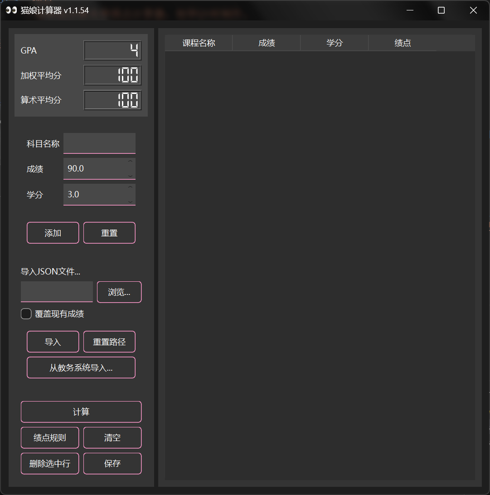
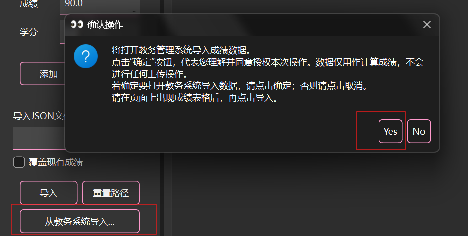
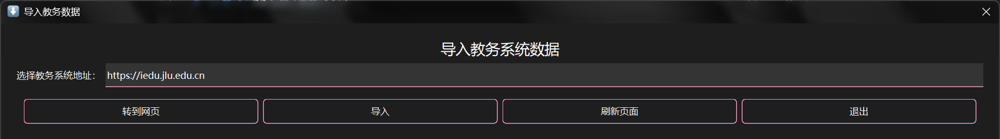
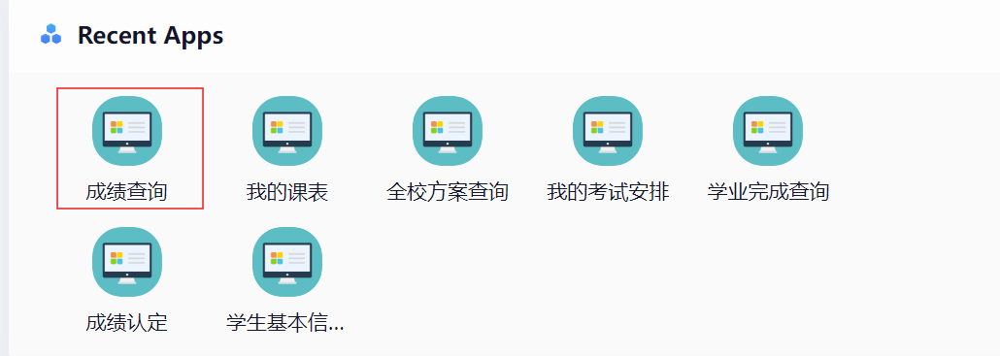
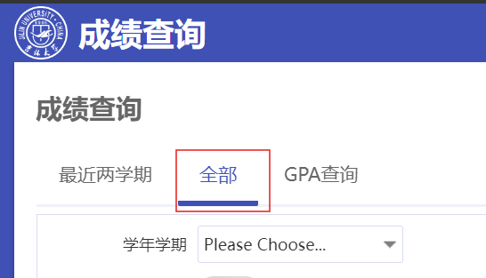
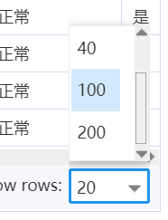
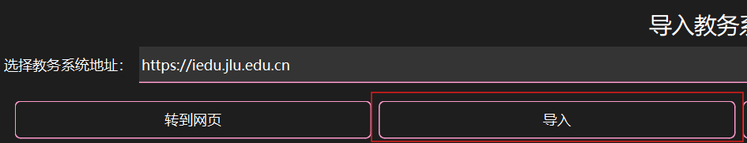
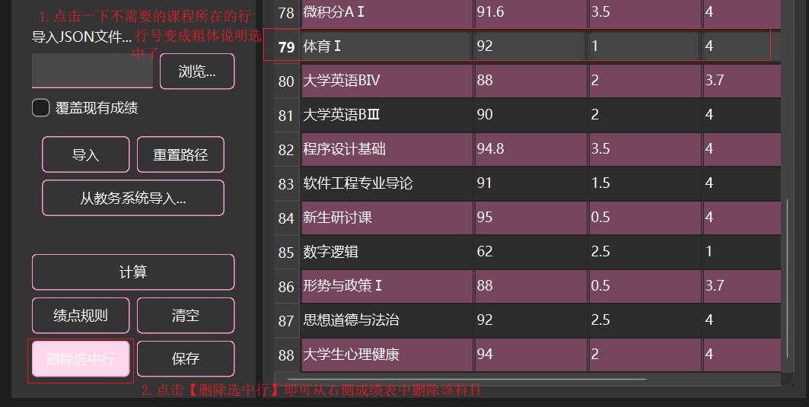
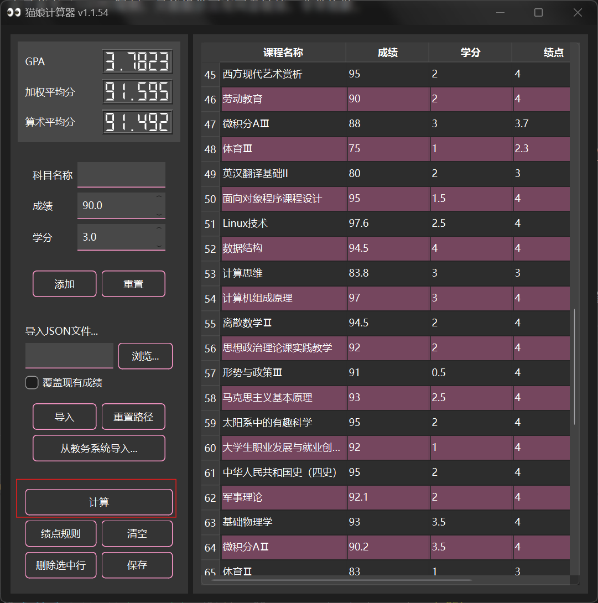

# 吉林大学绩点计算器

本质上其实跟您在网页上运行一个油猴脚本差不多，只不过当时学Qt，一时兴起做了这个东西，现在看来挺鸡肋的。

## 下载
[百度网盘](https://pan.baidu.com/s/1OVhEg1mv7Zt_1PS0bfj8Gw?pwd=xvrf)

由于蓝奏云100MB限制，只能提供百度网盘链接，非常抱歉。

## 使用方法

1. 解压，双击打开程序（`gpacalculator.exe`，图标是眼睛的那个）

2. 点击【从教务系统导入】，选Yes，打开内部浏览器窗口

3. 输入教务系统网址，如果在校内就是`https://iedu.jlu.edu.cn`，校外就先输入`https://vpn.jlu.edu.cn`，找到教务系统后，点成绩查询，刷出成绩表格。

4. 最好是点全部成绩查询，再把右下角那个条目数拉满，在浏览器上面点【导入】

5. 关闭浏览器窗口，在计算器右侧的表格里面，选中您不需要的课程（比如计算保研绩点需要删除选修课、体育、军训、英语七选一），点【删除选中项】，删除不需要的课程

6. 点击【计算】，左上角显示你的GPA、加权平均分、算术平均分

## 免责声明
- 该程序制作水平较低，计算的绩点数据仅供参考，不作为您留学、推免、评奖、评优的成绩依据。
- 该程序未收集您的个人信息，未对吉林大学教务系统进行逆向，仅在程序运行期间收集了前端可见的数据并进行自动化计算，且不会在本人所有的存储设备上（或使用的网络存储服务账号）存储任何数据。所有代码可在[GitHub](https://github.com/lycatears/jlu/tree/main/Qt%E8%B7%A8%E5%B9%B3%E5%8F%B0%E7%BC%96%E7%A8%8B/%E7%BB%A9%E7%82%B9%E8%AE%A1%E7%AE%97%E5%99%A8)浏览。如您不同意该程序使用上述成绩数据进行计算，请勿使用。
- 封面由GPT Image2 AI生成。
